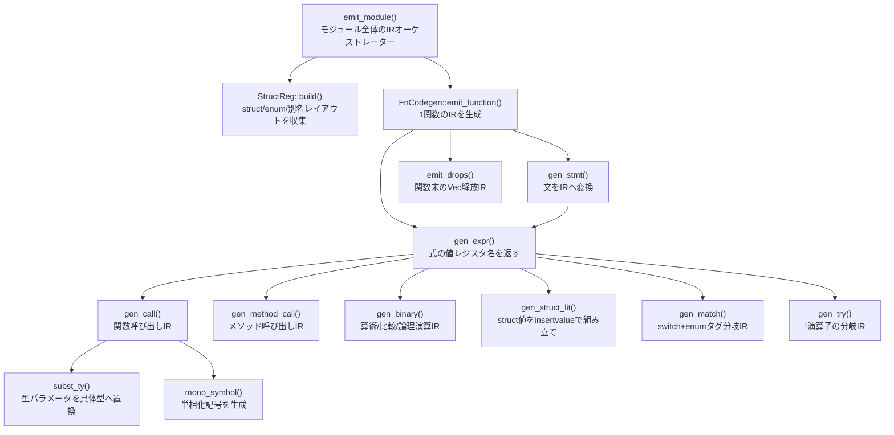

# コード生成コールグラフ

`emit_module()` から実際に呼ばれる関数のみ。深さ 5 以下、20 ノード以下。

## 各ノードの責務

| ノード | 責務 |
|---|---|
| `emit_module()` | struct 型宣言・文字列グローバル・関数 IR を順に出力してモジュール文字列を組み立てる |
| `StructReg::build()` | TypeDef から struct/enum のフィールド順・バリアント順・別名を収集する |
| `emit_function()` | 引数 alloca・本体 IR の生成・末尾 ret の補完を行う |
| `gen_stmt()` | Let/Return/Assign/Expr/While/For 各文を LLVM IR 命令列に変換する |
| `gen_expr()` | 式の値を保持するレジスタ名（`%t0` 等）を返す。IR を `body` に emit する |
| `gen_call()` | 名前解決結果から呼び出し記号を決定し `call` 命令を生成する |
| `gen_method_call()` | `method_provider` を参照して提供元ラベルを決定し `call` を生成する |
| `gen_binary()` | 整数は `add`/`sub`/`mul`/`icmp`、浮動小数は `fadd`/`fcmp` を使い分ける |
| `gen_struct_lit()` | フィールド値を順に `insertvalue` 命令で struct 値へ組み込む |
| `gen_match()` | scrutinee の enum タグを読み出し `switch` で腕を分岐する |
| `gen_try()` | `!` 演算：Ok なら値を取り出し、Err なら呼び出し元へ早期 `ret` する |
| `subst_ty()` | ジェネリック関数展開時に型パラメータ名を具体型へ再帰的に置換する |
| `mono_symbol()` | `fn_name.mangled_ty1.mangled_ty2` 形式の単相化記号文字列を作る |
| `emit_drops()` | ドロップフラグが立った Vec の `ptr` を `@__iris_free` で解放する IR を出力する |
