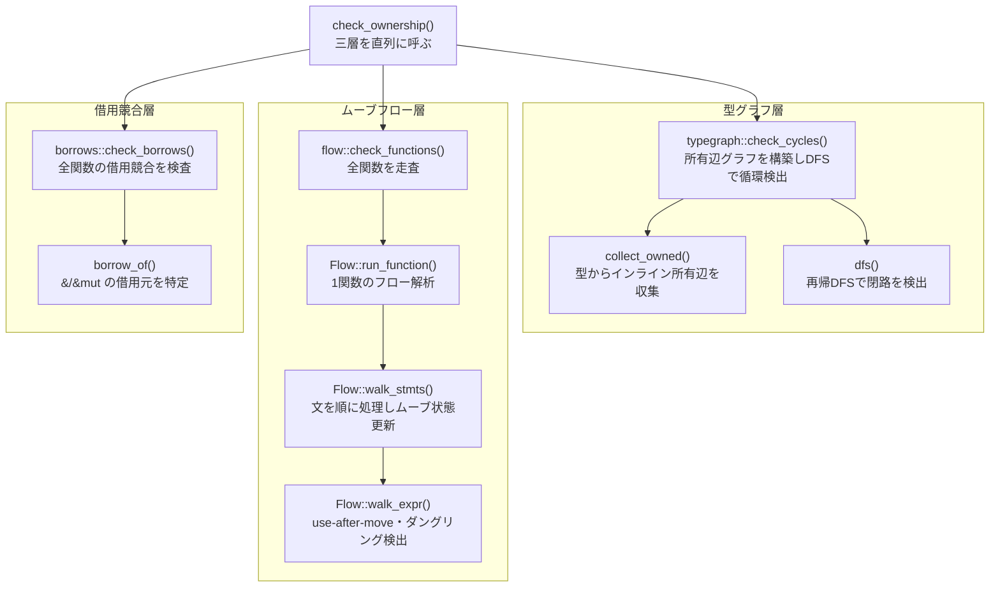

# 所有権解析コールグラフ

`check_ownership()` から実際に呼ばれる関数のみ。深さ 5 以下、20 ノード以下。

## 各ノードの責務

| ノード | 責務 |
|---|---|
| `check_ownership()` | `typegraph`・`flow`・`borrows` を直列に呼び、エラーを集約する |
| `check_cycles()` | 型定義の所有辺グラフを構築し DFS で循環（無限サイズ型）を検出する |
| `collect_owned()` | 型 `Type` から `&T`/`Box`/`Vec` を除いた所有辺を収集する |
| `dfs()` | 有向グラフを再帰 DFS し、灰色ノードへの後退辺を閉路として報告する |
| `check_functions()` | 全 Function を走査し `Flow::run_function()` を呼ぶ |
| `Flow::run_function()` | 関数の State（所有フラグ集合）を初期化して `walk_stmts()` を呼ぶ |
| `Flow::walk_stmts()` | 文を前進走査し State を更新する。if/match 分岐では各腕を merge する |
| `Flow::walk_expr()` | 識別子の use-after-move・ダングリング返却を State を参照して検出する |
| `check_borrows()` | 全 Function を走査し `&`/`&mut` の競合（排他性違反）を検出する |
| `borrow_of()` | `&e`/`&mut e` 式から借用元の DefId と可変性を返す |
