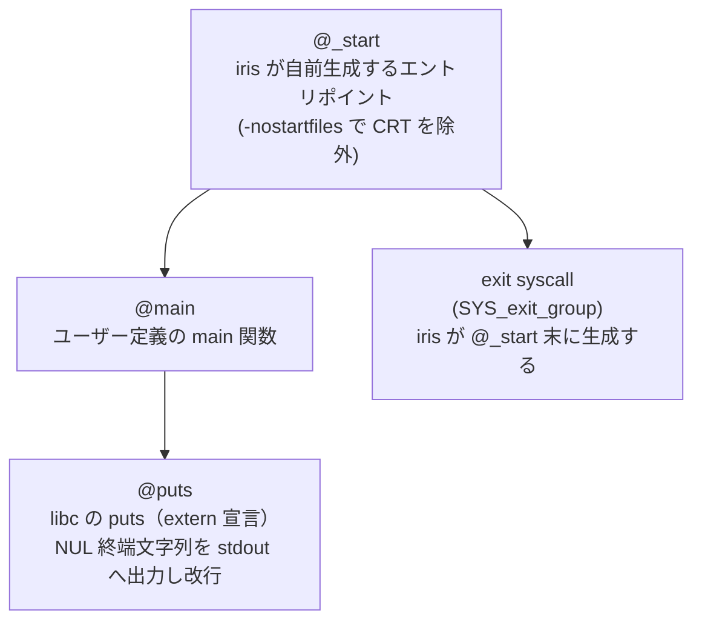

# ランタイム呼び出しグラフ

生成された実行ファイルの起動時・実行時に実際に呼ばれる関数。
Hello World（`puts("hello")`）を例に取る。

## ランタイム関数の仕様

| 関数 | 起点 | 役割 |
|---|---|---|
| `@_start` | OS のローダー（ELF エントリ） | `main()` を呼び、終了時に exit syscall を発行する。iris の codegen が自動生成 |
| `@main` | `@_start` | ユーザーコードのエントリ。引数なし・戻り値 void |
| `@puts` | `@main`（または `@println_int` 等の prelude 関数） | libc の `puts`。文字列に改行を付けて stdout へ書き出す |
| `@__iris_alloc` | `Vec::new()` 等のヒープ確保 | `mmap` syscall でメモリを確保（ADR-0012。-nostartfiles で malloc が使えないため） |
| `@__iris_free` | 関数末の `emit_drops()` が生成した IR | `munmap` syscall でメモリを解放 |

## 補足：libc との依存関係

`-nostartfiles` で CRT（`crt0.o`、`crti.o` 等）を除外しているが、
libc 自体は動的リンクのまま（`puts`・`strlen`・`malloc`・`free` 等）。
`@__iris_alloc`/`@__iris_free` は mmap syscall を直接使うが、
`puts` は依然として libc 経由である。
