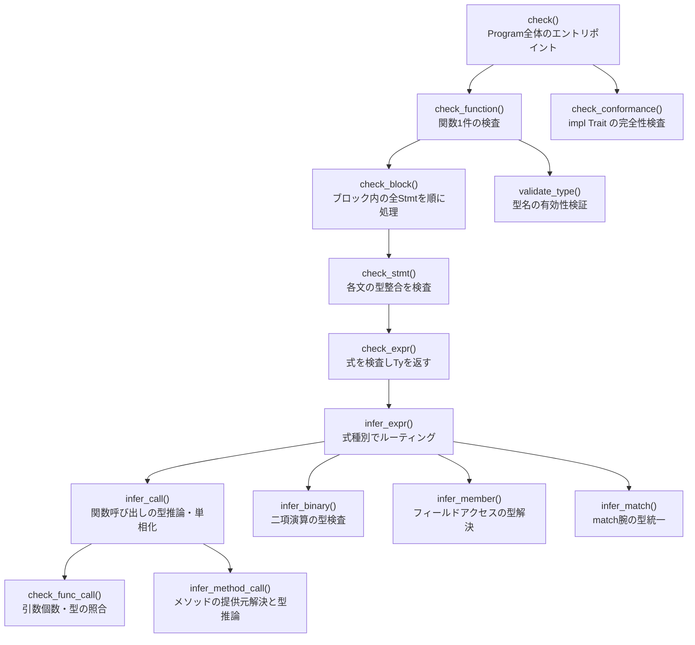

# 型検査コールグラフ

`check()` から実際に呼ばれる関数のみ。深さ 5 以下、20 ノード以下。

## 各ノードの責務

| ノード | 責務 |
|---|---|
| `check()` | Program の全 Item を走査し Function/Impl/Trait を振り分ける |
| `check_function()` | 型パラメータ環境を設定し、引数型を DefId に登録して本体を検査する |
| `check_block()` | Block 内の全 Stmt を順に `check_stmt()` に渡す |
| `check_stmt()` | Let/Return/Assign/Expr/While/For の型整合を検査する |
| `check_expr()` | `infer_expr()` に委譲し結果を `expr_types` に記録する |
| `infer_expr()` | ExprKind で分岐して専用推論関数へルーティングする |
| `infer_call()` | 引数の型推論・ジェネリック単相化情報を `mono` に記録する |
| `check_func_call()` | 引数個数・型の不一致をエラーに追加する |
| `infer_method_call()` | 提供元ラベルを解決し `method_provider` に記録する |
| `infer_binary()` | 被演算子の型要件を検査し結果型を返す |
| `infer_member()` | struct のフィールド名と型を解決する |
| `infer_match()` | scrutinee 型と腕パターンを照合し腕ボディの型を統一する |
| `check_conformance()` | 全 `impl Trait for Type` のメソッド実装の過不足を検査する |
| `validate_type()` | 型名が `known_types` に含まれるかを検証する |
