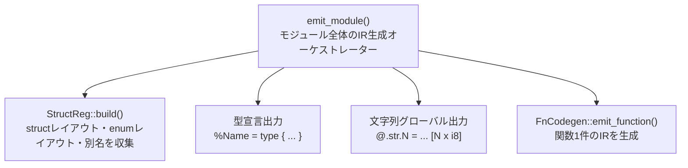
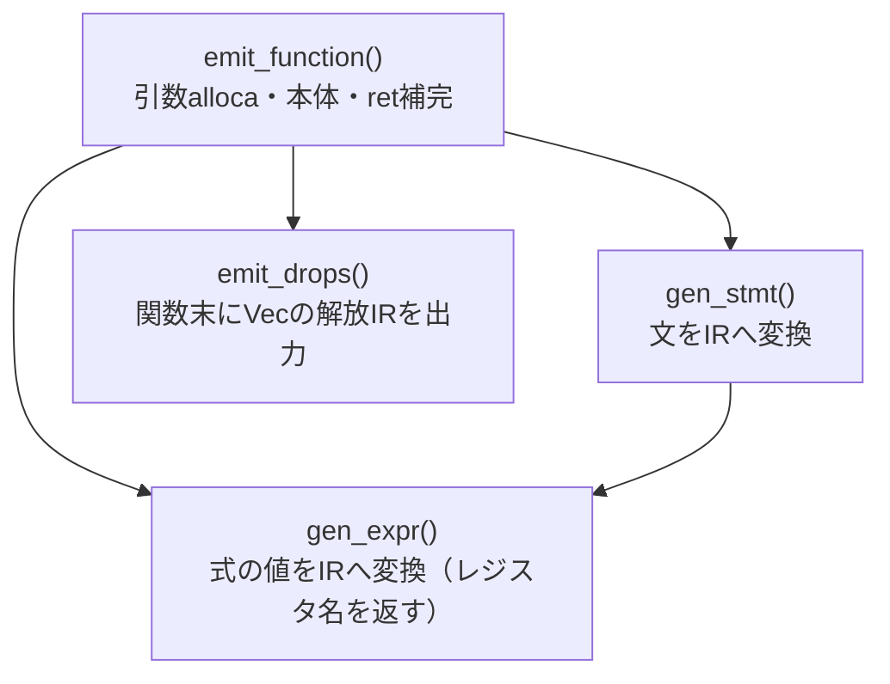
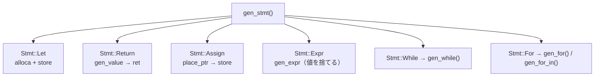

# コード生成：呼び出しグラフと関数仕様

エントリポイントは `codegen::emit_module()`（`src/codegen.rs:361`）。
LLVM IR テキストを直接文字列として構築する。

## emit_module の構造



## emit_function の構造



## gen_stmt の分岐



## gen_expr の分岐

```mermaid
flowchart TD
    gen_expr["gen_expr()"]
    lit["Int/Float/Bool\nリテラル文字列を直接返す"]
    str_lit["Str\nstrings.intern() → @.str.N"]
    ident["Ident\nlookup() → load"]
    call["Call → gen_call()"]
    method["Member（呼び出し）→ gen_method_call()"]
    binary["Binary → gen_binary()"]
    unary["Unary → gen_unary()"]
    struct_lit["StructLit → gen_struct_lit()"]
    if_expr["If → gen_if()（値なし）"]
    match_expr["Match → gen_match()"]
    cast["Cast → gen_cast()"]
    try_expr["Try(!) → gen_try()"]

    gen_expr --> lit
    gen_expr --> str_lit
    gen_expr --> ident
    gen_expr --> call
    gen_expr --> method
    gen_expr --> binary
    gen_expr --> unary
    gen_expr --> struct_lit
    gen_expr --> if_expr
    gen_expr --> match_expr
    gen_expr --> cast
    gen_expr --> try_expr
```

## 関数仕様表

| 関数 | 入力 | 出力 | 責務 | 副作用 |
|---|---|---|---|---|
| `emit_module()` | `&Program`, `&Resolution`, `&TypeInfo` | `Result<String, CodegenError>` | モジュールIR全体を組み立てる | `String` バッファに追記 |
| `StructReg::build()` | `&Program` | `StructReg` | struct/enum/別名レイアウトを収集 | なし |
| `emit_function()` | `&Function`, symbol `&str` | `Result<String, CodegenError>` | 引数alloca・本体IR・ret補完 | `FnCodegen` の内部バッファに追記 |
| `gen_stmt()` | `&Stmt` | `Result<(), CodegenError>` | 各文の種類に応じてIRを生成 | `FnCodegen.body` に追記 |
| `gen_expr()` | `&Expr`, hint `&str` | `Result<String, CodegenError>` | 式の値を保持するレジスタ名を返す | `FnCodegen.body` に追記（命令を emit） |
| `gen_call()` | callee `&Expr`, args, span | `Result<String, CodegenError>` | 関数呼び出しIR。syscall・is_null・ジェネリック単相化も処理 | モノモルフィゼーション記号の生成 |
| `gen_method_call()` | object, method, qualifier, args | `Result<String, CodegenError>` | メソッド呼び出しIR。提供元ラベルから記号を決定 | なし |
| `gen_binary()` | op, lhs, rhs, span | `Result<String, CodegenError>` | 算術・比較・論理演算のIR生成 | なし |
| `gen_struct_lit()` | name, fields, span | `Result<String, CodegenError>` | struct 値を insertvalue 命令で組み立てる | なし |
| `gen_match()` | scrutinee, arms, span | `Result<String, CodegenError>` | switch + enum タグ分岐 IR | なし |
| `gen_try()` | inner, span | `Result<String, CodegenError>` | `!` 演算子：Ok/Err を分岐して Err なら早期 return | なし |
| `subst_ty()` | `&Ty`, map | `Ty` | 型パラメータを具体型へ置換（単相化） | なし |
| `mono_symbol()` | name, args | `String` | `name.i32.string` 形式の単相化記号を生成 | なし |
| `emit_drops()` | なし | なし | 関数末でドロップフラグが立つ Vec を `@__iris_free` で解放 | `body` に追記 |

## 重要な内部状態（`FnCodegen` 構造体）

| フィールド | 役割 |
|---|---|
| `body: String` | 現在生成中の関数 IR バッファ |
| `entry_allocas: String` | entry ブロック先頭の alloca（ドロップフラグ等） |
| `locals: HashMap<DefId, (String, String)>` | DefId → (alloca ポインタ名, LLVM型) |
| `tmp_counter: usize` | `%t0`, `%t1` … のレジスタ連番 |
| `label_counter: usize` | ブロックラベル連番 |
| `terminated: bool` | 現在ブロックが終端済みか（二重 ret を防ぐ） |
| `strings: RefCell<StringIntern>` | 文字列リテラルの重複排除とグローバル番号管理 |
