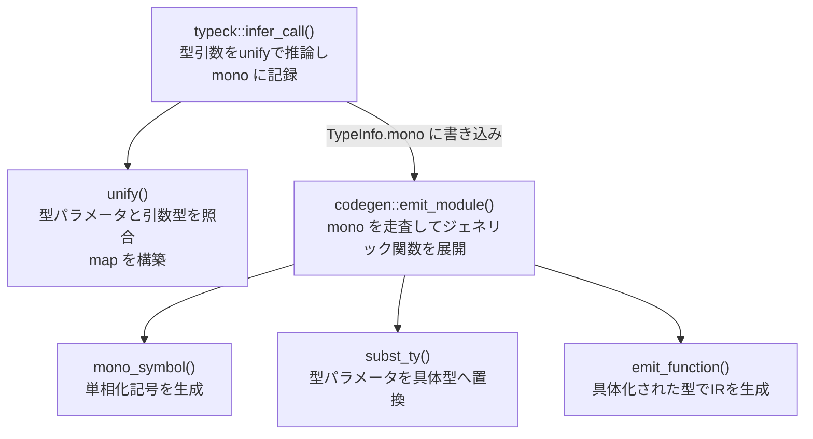

# ジェネリック型と単相化

ジェネリクスは**呼び出し箇所で具体型へ展開する（単相化）**方式。
型検査が単相化情報を収集し、コード生成がその情報を使って per-instantiation の記号を作る。

## データの流れ

```
fn f<T>(x: T): T { ... }    ← ソース（ジェネリック関数定義）
  ↓ typeck::infer_call()
TypeInfo.mono: {             ← 呼び出し箇所のspan → (関数名, 具体型引数)
  span_of_call → ("f", [Ty::Named("i32")])
}
  ↓ codegen::emit_module()
mono_symbol("f", &[i32])    ← "f.i32" という記号を生成
  ↓
define i32 @f.i32(i32 %arg0) { ... }   ← per-instantiation の LLVM IR
```

## 型検査における単相化情報の収集

`infer_call()`（`src/sema/typeck.rs:1208`）がジェネリック関数の呼び出しを検出する。

```
infer_call()
  ↓ 引数型から unify() を呼んで型パラメータ → 具体型のマップを作る
  ↓ TypeInfo.mono[callee_span] = (fn_name, concrete_types) を記録
```

`unify()`（`src/sema/typeck.rs:2267`）は型パラメータ `T` と引数型 `i32` を照合し
`map["T"] = Ty::i32` を返す。ネストしたジェネリクス（`Vec<T>` 等）も再帰的に処理する。

## コード生成における単相化の展開

`emit_module()`（`src/codegen.rs:361`）は `TypeInfo.mono` に記録された呼び出し箇所を走査し、
ジェネリック関数を per-instantiation ごとに展開する。

### `mono_symbol()`（`src/codegen.rs:1023`）

| 入力 | 出力 | 責務 |
|---|---|---|
| 関数名 `name: &str`、型引数 `args: &[Ty]` | `String` | `name.mangled_ty1.mangled_ty2` 形式の記号を生成 |

例：`mono_symbol("f", &[Ty::Named("i32")])` → `"f.i32"`

### `subst_ty()`（`src/codegen.rs:874`）

| 入力 | 出力 | 責務 |
|---|---|---|
| `ty: &Ty`、`map: &HashMap<String, Ty>` | `Ty` | 型パラメータ名を具体型へ再帰的に置換 |

`emit_function()` 内でジェネリック関数を展開するとき、引数型・戻り値型・ローカル変数型を
すべて `subst_ty()` で具体化してから LLVM 型へ変換する。

### `mangle_ty()`（`src/codegen.rs:1127`）

| 入力 | 出力 | 責務 |
|---|---|---|
| `ty: &Ty` | `String` | 型を記号名に使える文字列へ変換（`Vec<i32>` → `Vec_i32` 等） |

## 単相化コールグラフ



## 現状の制限

- `TypeInfo.mono` に記録されるのは**直接呼び出し**のみ。関数ポインタ・クロージャ経由は未対応。
- ジェネリック struct は `%Name.i32` 形式の per-instantiation LLVM 型として展開される
  （`StructReg::generic_struct_instance()`）。
- enum は `enum_is_aggregate()` でペイロードが集約型かスカラか判定し、記号を分ける。
