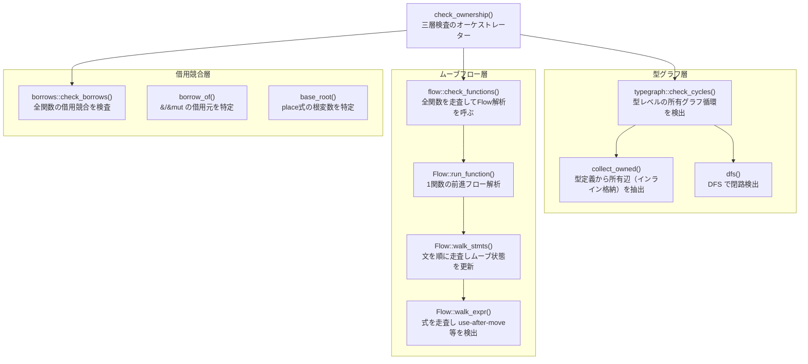

# 所有権解析

エントリポイントは `sema::check_ownership()`（`src/sema/ownership/mod.rs:51`）。
三つの検査を直列に実行する。

## コールグラフ

## 各検査の仕様

### 1. 型グラフ循環検出（`typegraph::check_cycles`）

| 項目 | 内容 |
|---|---|
| 入力 | `&Program`（TypeDef のみ参照） |
| 出力 | `&mut Vec<OwnershipError>` に追記 |
| 検査内容 | ユーザー定義型を頂点、インライン所有辺を辺としたグラフを構築し DFS で循環を検出する |
| 所有辺を**作る**もの | 名前付き型 `B`（Bがユーザー型）、`Option<T>`、`Result<T,E>`、配列 `T[]` |
| 所有辺を**作らない**もの | `&T`（参照）、`Box<T>`・`Vec<T>`・`Map`・`Set`（ヒープ間接） |

循環 = 無限サイズ型（例: `type A = struct { x: A }`）。`Box<A>` なら循環にならない。

### 2. ムーブ＋ライフタイムフロー（`flow::check_functions`）

| 項目 | 内容 |
|---|---|
| 入力 | `&Program`、`&Resolution`、`&TypeInfo` |
| 出力 | `&mut Vec<OwnershipError>` に追記 |
| 検査内容 | 各関数を前進フロー解析し、ムーブ後の使用（use-after-move）と、ローカルを指す参照の返却（ダングリング）を検出する |

`State` は変数 DefId ごとの「所有中 / ムーブ済み」フラグの集合。
分岐（if/match）では各腕の `State` を `merge()` でマージする。

### 3. 借用競合（`borrows::check_borrows`）

| 項目 | 内容 |
|---|---|
| 入力 | `&Program`、`&Resolution`、`&TypeInfo` |
| 出力 | `&mut Vec<OwnershipError>` に追記 |
| 検査内容 | `&mut` の排他性（同じ場所への `&mut` が2つ以上存在しないか）と、共有借用中の可変借用（`&` が存在する間の `&mut`）を検査する |
| 制限 | 現状スコープベースの保守的な検査。NLL（非字句ライフタイム）は未実装 |
