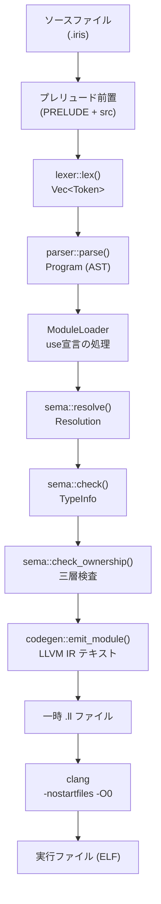

# コンパイラパイプライン概要

Hello World が実行ファイルになるまでの各段の責務・入出力をまとめる。

## 段ごとの概要

| 段 | 入力 | 出力 | 責務 | 実装 |
|---|---|---|---|---|
| Source | ファイルパス | `&str`（プレリュード前置済み） | プレリュード（`std/prelude.iris`）をソース先頭に連結し単一文字列にする | `lib.rs::analyze()` |
| Lex | `&str` | `Vec<Token>` | nom + nom_locate で文字列をspan付きトークン列へ変換。改行は`Newline`として残す | `lexer::lex()` |
| Parse | `&[Token]` | `Program` | nom による再帰下降。式は優先順位段で分解し AST を構築 | `parser::parse()` |
| Resolve | `Program` | `Resolution` | スコープ構築・識別子使用→定義の対応付け・モジュール読み込み | `sema::resolve()` |
| TypeCheck | `Program` + `Resolution` | `TypeInfo` | 式への型付与・引数/戻り値/代入の整合性検査・ジェネリクス単相化情報の収集 | `sema::check()` |
| Ownership | `Program` + `Resolution` + `TypeInfo` | `()` (or error) | 三層検査（型グラフ循環・ムーブフロー・借用競合） | `sema::check_ownership()` |
| Codegen | `Program` + `Resolution` + `TypeInfo` | `String`（LLVM IR テキスト） | LLVM IR テキストを生成。clangへ渡せる形式 | `codegen::emit_module()` |
| Assemble/Link | `String`（IR）→ 一時 `.ll` ファイル | 実行ファイル | `clang -O0 -nostartfiles file.ll -o out` で ELF バイナリを生成 | `main.rs::build()` |

## パイプライン図

## 備考

- `analyze()` が Lex→Parse→Resolve→TypeCheck→Ownership を直列に呼ぶ。
- `compile_ir()` が `analyze()` + `emit_module()` を呼ぶ。
- `build()` が `compile_ir()` の結果を一時ファイルに書き、`clang` に渡す。
- エラーは各段で `miette::Report` に変換して表示する。複数エラーの収集は
  Resolve・TypeCheck・Ownership が対応（1件で止まらない）。
