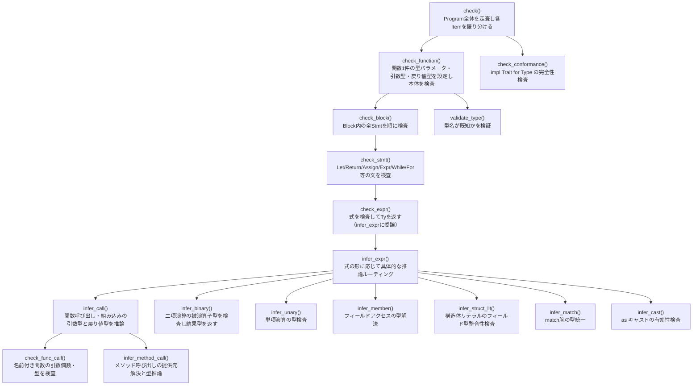

# 型検査：呼び出しグラフと関数仕様

エントリポイントは `sema::check()`（`src/sema/typeck.rs:137`）。

## コールグラフ

## 関数仕様表

| 関数 | 入力 | 出力 | 副作用 |
|---|---|---|---|
| `check()` | `&Program`, `&Resolution` | `Result<TypeInfo, Vec<TypeError>>` | `Checker` を構築し全 Item を走査 |
| `check_function()` | `&Function` | なし | `self.generics` に型パラメータを設定、`check_block()` を呼ぶ |
| `check_block()` | `&Block` | なし | 各 Stmt に `check_stmt()` を呼ぶ |
| `check_stmt()` | `&Stmt` | なし | Let/Return/Assign の型整合を検査、`check_expr()` を呼ぶ |
| `check_expr()` | `&Expr` | `Ty` | `infer_expr()` に委譲し `expr_types` に記録 |
| `infer_expr()` | `&Expr` | `Ty` | ExprKind で分岐して専用推論関数へルーティング |
| `infer_call()` | callee `&Expr`, args `&[Expr]`, span | `Ty` | ジェネリック単相化情報を `mono` に記録 |
| `check_func_call()` | name, span, args, arg_tys | `Ty` | 引数個数・型不一致をエラーに追加 |
| `infer_method_call()` | object, method, args, span | `Ty` | `method_provider` に提供元ラベルを記録 |
| `infer_binary()` | op, lhs, rhs | `Ty` | 被演算子の型不一致をエラーに追加 |
| `infer_member()` | object, field, span | `Ty` | struct のフィールド型を解決 |
| `infer_struct_lit()` | name, fields, span | `Ty` | フィールド名・型の整合性を検査 |
| `infer_match()` | scrutinee, arms, span | `Ty` | 腕パターン型とスクルティニー型を照合、腕ボディの型を統一 |
| `check_conformance()` | なし | なし | `impl Trait for Type` の全メソッドが揃っているかを検査 |
| `validate_type()` | `&Type` | なし | 型名が `known_types` に存在するかを検証、エラーを追加 |

## 重要な状態（`Checker` 構造体）

| フィールド | 役割 |
|---|---|
| `expr_types: HashMap<Span, Ty>` | 各式の型（→ `TypeInfo` へ移す） |
| `mono: HashMap<Span, (String, Vec<Ty>)>` | ジェネリック呼び出しの単相化情報 |
| `def_types: Vec<Ty>` | DefId ごとの型（引数・ローカル変数） |
| `generics: HashMap<String, Vec<Bound>>` | 現在の関数の型パラメータ→境界 |
| `errors: Vec<TypeError>` | 収集したエラー（複数件まとめて報告） |
